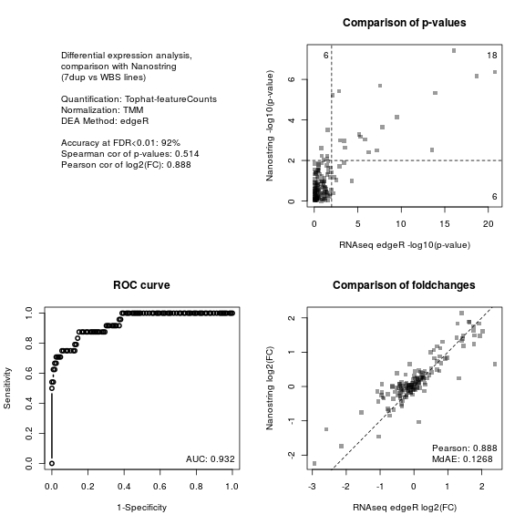
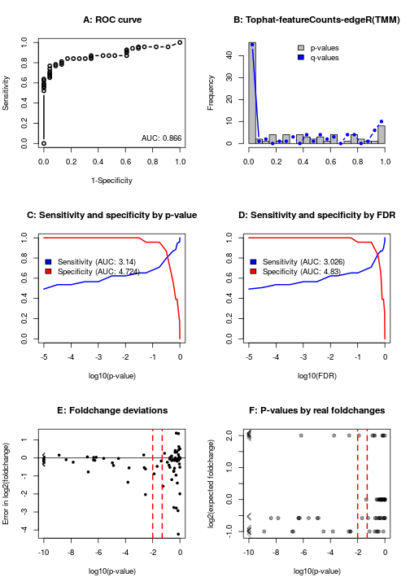
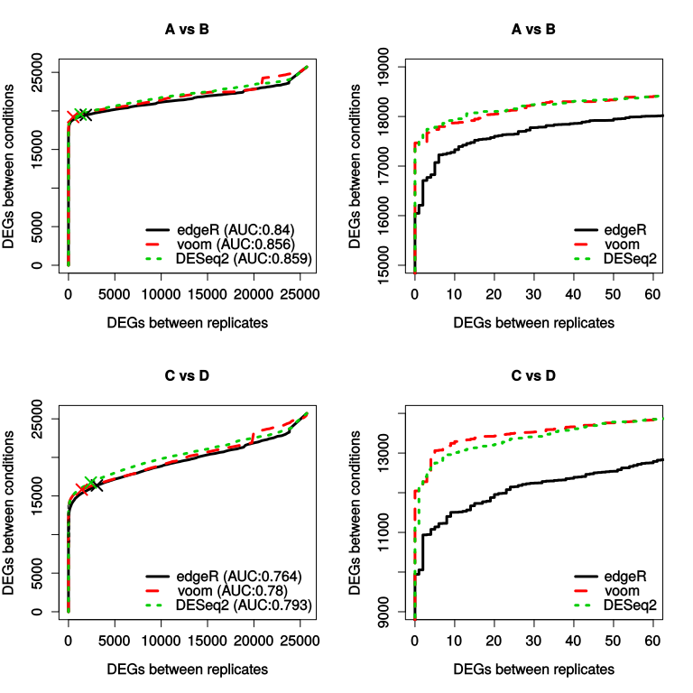

# The RNAontheBENCH package

This package provides empirical and computational resources for benchmarking RNAseq analysis methods, harnessing a number of features:

- a RNAseq dataset from 12 human iPSC lines all including ExFold ERCC spike-ins (92 transcripts in known concentrations, some of which are differentially-expressed across mixes), as well as an additional validation dataset of 6 samples
- a panel of 150 genes (including multiple isoforms for some genes) measured, in the same samples, by the very precise Nanostring nCounter technology
- a set of internal, 'genetic controls' (genes with different copy-numbers and known to be expressed linearly with copy-numbers)
- accuracy metrics based on feature-wise z-scores across samples, in order to assess differential expression accuracy.

This help will guide you through its main usage.
  
  
  
  
        
        
# Installing the package and fetching the data

## Install the package

To install the package, download it and install it using the following R command:
```
install.packages("path/to/RNAontheBENCH.zip", repos=NULL)
```

Alternatively, if you have `devtools` installed you can install the package directly from the git repository using:
```
library(devtools)
install_git("https://github.com/plger/RNAontheBENCH", build_vignettes=TRUE)
```

Once the package is installed, you can load it and access the vignette for some examples:
```
library(RNAontheBENCH)
vignette("RNAontheBENCH")
```

## Download the data and analyze it with your method of choice


The benchmark is made using a specific dataset of stranded Truseq mRNA-seq libraries (Ribozero) with 100bp paired-end reads, coming from human induced pluripotent stem cell lines harbouring copy-number alterations of the 7q11.23 region. 
The RNA-seq data was published in <a href="http://www.ncbi.nlm.nih.gov/pubmed/25501393">Adamo A, Atashpaz S, Germain PL et al., <i>Nature Genetics</i> 2015, 2:132-41</a>, and is available through the <a href="http://www.ncbi.nlm.nih.gov/geo/query/acc.cgi?acc=GSE63058">GEO series GSE63055</a>.

You will need to download samples GSM1538995 through GSM1539007, and quantify them using your method of choice. Specifically, the following samples should be analyzed and given the names below:

| Sample name | GEO ID |
|:------------|:-------|
|AJ80 | GSM1538995 |
|AJ81 | GSM1538996 |
|AJ82 | GSM1538997 |
|AJ83 | GSM1539001 |
|AJ84 | GSM1539002 |
|AJ86 | GSM1539003 |
|AJ87 | GSM1539004 |
|AJ89 | GSM1538999 |
|AJ90 | GSM1539005 |
|AJ91 | GSM1539006 |
|AJ92 | GSM1539007 |
|AJ93 | GSM1539000 |

For reasons of comparability, we recommend using the NCBI GRCh38 genome, more specifically the sequence file `GCA_000001405.15_GRCh38_no_alt_analysis_set.fna` supplemented with the sequence of the ERCC spike-ins, and the corresponding gtf file also supplemented with the spike-in annotation. The spike-in sequences and .gtf annotation are available from <a href="http://www.thermofisher.com/order/catalog/product/4456739">the spike-ins' product page</a>.

Keep in mind that the libraries are stranded (ISR in the Sailfish/Salmon nomenclature, fr-firststrand in the Tuxedo nomenclature).

For the validation dataset (optional), the samples are the following:

| Sample name | GEO ID |
|:------------|:-------|
|CFG.sh2 | GSM1539030 |
|CFG.shCTR | GSM1539029 |
|c3391S.sh2 | GSM1539042 |
|c3391S.shCTR | GSM1539041 |
|w306o.shCTR | GSM1539037 |
|w306o.sh2 | GSM1539038 |

Finally, some functions (see below) can also be applied on the SEQC dataset. For more information on that dataset, see <a href="http://doi.org/10.1038/nbt.2957">Su et al. (2014) "A comprehensive assessment of RNA-seq accuracy, reproducibility and information content by the Sequencing Quality Control Consortium", Nature Biotechnology, 32(9), 903–14</a>.

## Make sure your expression matrices are formatted in the right way

The package expects expression matrices to have refseq ID or gene symbols as row names, and sample names (e.g. `AJ80', as indicated in the tables above) as column headers.

Expression values can be read/fragments counts, FPKM, or TPM, and will be automically converted to TPM.

If you do not provide a gene-level quantification, transcripts TPMs will automatically be summed to genes.
  
  
  
  
  
# Benchmarking quantification

Benchmarking a quantification can be done using a series of functions making specific comparisons (see `?compareWithNanostring`, `?analyzeSpikein`, `?compareWithPCR`, and `?compareSimulated`), or through the `benchmarkWrapper()` function, which calls all other functions on the analysed datasets and wraps the results in an html page.

## The benchmarkWrapper() function

To avoid confusion, it is best to 

1. rename the quantification files to `w12.transcripts.quant` (and eventually `w12.genes.quant`) for the 12-samples dataset, `w6.transcripts.quant` for the 6-samples dataset, and `simulated.quant` for the simulated data;
2. put your quantification files in the folder where you want the results of the analyis to be saved;
3. call the package using 
```
benchmarkWrapper("folder_containing_quantification", "analysis_name", qt="FPKM")
```
where 'qt' indicates the unit of the expression matrices (either 'COUNTS', 'FPKM', or 'TPM').

It is possible to run the benchmarkWrapper function even if only one dataset has been quantified. See `?benchmarkWrapper` for an example.

The benchmarkWrapper function calls a number of functions from the package (`compareWithNanostring`, `analyzeSpikein`, `compareWithPCR`, and `compareSimulated`), each of which can be called separately for further options (please see the help entry of each function for more detail). In addition, the benchmarkWrapper function generates a html file for browsing the results of the analysis.

### Example usage

You can test the benchmarkWrapper function using the example data included in the package. We first load the data (two count matrices produced by featureCounts on the Tophat alignment, one for gene-level counts and the other for transcript-level), and save it in the folder in which we'll want to save the results of the benchmark:
```
library("RNAontheBENCH")
data(exampledata)
dir.create("example")
write.table(exampleTranscriptLevel,"example/w12.transcripts.quant",sep="\t",quote=F)
write.table(exampleGeneLevel,"example/w12.genes.quant",sep="\t",quote=F)
```

(Of note, to reduce their size the matrices contain only spike-ins, genes/transcripts of the Nanostring panel, as well as features with a certain number of reads assigned to them).

Then we call the function, specifying that the expression values are counts:
```
benchmarkWrapper("example", "tophat.featureCount", qt="counts")
```

A number of files will be saved in the "example" folder, including an html file allowing to browse these results. These results are the same that can be browsed on the <a href="https://bio.ieo.eu/rnaseqBenchmark/">online platform</a>.
  
  
  
  
  
# Benchmarking differential expression analysis (DEA)


The package also includes a number of functions to benchmark differential expression analysis methods, based either

1. on the Nanostring data
2. on the known concentrations of the spike-in mixes
3. on the in-group/out-group comparison of the SEQC dataset.

For differential expression methods which take a count matrix as input (e.g. edgeR, DESeq, etc), functions are included which take the count matrix, run the analysis, and benchmark the results. For other methods, such as Cuffdiff, it is necessary to provide the analysis results as a data.frame with gene or transcript IDs are row.names, and with at least the columns "p" (for p-value), "log2FC", and "fdr".

(Note: to avoid differences due solely to FDR calculation, all comparisons are based on uncorrected p-values; moreover, where possible the TMM normalization is applied to all methods.)

## Comparing differential expression calls to the Nanostring data

To compare differential expression calls to nanostring, you can simply use the `deNanostring()` function, providing your count matrix:
```
data(exampledata)
deNanostring( exampleGeneLevel, method="edgeR", norm="TMM", 
   quantification="Tophat-featureCounts")
```



This function performs the specified DEA analysis, and benchmarks the results by comparing them to a t-test applied to the log-transformed Nanostring measurements, using by default a p-value of 0.01 to identify a gene as differentially-expressed (this can be specified with the 'threshold' argument of the `deNanostring()` function). The figure plotted provides some measures of accuracy, a comparison of the p-values, a comparison of the foldchanges, as well as a Receiver-Operator Characteristic (ROC) curve (and the area under it).

If you have the results from a DEA analysis performed outside R, such as from Cuffdiff, you simply need to reformat them to a data.frame with gene/transcript IDs are row.names, and with at least the columns "p" (for p-value) and "log2FC". You can then provide it to the `deNanostring.compare()` to produce the same diagnostic plots.

## Comparing differential expression calls to the known differences between spike-in mixes

Samples from both the datasets in this study and the SEQC dataset where spiked-in with two different mixes containing the same ERCC RNAs albeit in different concentration. These known differences can therefore be used to assess differential expression analyses. Of note, the ERCC spike-ins are neither spliced, nor overlapping any other genomic features, and as such they are more simple to map and quantify than most transcripts. However, they have the advantage of having both a very precisely known abundance and, unlike simulations (which are inevitably based on models), authentic experimental variation.

Once again, a function performs (for available methods) the differential expression call and its benchmark:
```
res <- deSpikein( exampleGeneLevel, method="edgeR", norm="TMM", 
   quantification="Tophat-featureCounts")
```




The function returns the differential expression calls, and produces a figure with six panels:

* A: The ROC curve, which gives a non-parametric assessment of the method.
* B: A histogram of p-values and fdr.
* C: Curves of the specificity and sensitivity over different p-value thresholds (this is parametric!), as well as the area under each curve.
* D: Same as C, except using FDR values.
* E: Error in estimated log2(foldchange) as a function of p-value.
* F: P-values across the different (real) foldchanges between mixes.

Of note, the function can take as input either the count data from the dataset used in this study, from the SEQC data, or _from any data including the ERCC ExFold spike-ins_. If using your own data, you will have to provide the function with a `mix1` argument specifing the samples (i.e. column names) that haved been spiked with mix1 (see `?deSpikein` for more information).

All the actual benchmarking and the generation of the plots is done by the function `deSpikein.compare()`, which is called by the `deSpikein()` function. This means that you can perform the analysis yourself, or import an external one (e.g. Cuffdiff), and pass it to the function. You simple need to make sure that the data is formatted as a data.frame with gene/transcript IDs are row.names, and with at least the columns "p" (for p-value), "log2FC" and "fdr". Note, however, that this will not used the 'homogenized spike-in normalization' (see below).

Sleuth users can use the `sleuthWrapper()` function, which performs the analysis with homogenized spike-in normalization and benchmark the results.

### A note regarding spike-in normalization

Spike-ins are loaded in the total RNA when preparing the libraries, and depending on the setting loading there can be variations in loading. For this reason, all spike-in based benchmarks in this package normalize the spike-ins separately from the rest of the transcriptome. Since a considerabe proportion of the spike-ins are differentially-expressed across mixes, the spike-in mixes are "homogenized" for the purpose of calculating normalization factors (dividing the quantifications by their expected foldchange; see `?homomixes`). If you want to disable this feature, simply perform the differential analysis yourself, and use the `deSpikein.compare()` function.

## Comparing differential expression calls within and across SEQC groups

The SEQC dataset includes transcriptomes from two different RNA samples ("A" and "B", respectively the Universal Human Reference RNA and the Human Brain Reference RNA), as well as from two mixtures of those samples ("C" and "D"), each with 5 replicates. Contrarily to the two previous cases, here the truth of differential expression is not known, and the working assumption behind this dataset is that a detected differential expression between groups (i.e. mixtures) is putatively true, while a detected differential expression within groups (i.e. between replicates of a given sample) is a false positive. Plotting the number of genes in both comparisons that a below a sliding p-value threshold therefore gives a picture analogous to the ROC curve, which in the context of this package we'll call a "positives curve".

Given the relevant comparisons, such curves can be produced by the `posplot()` function (see `?posplot` for more information). Alternatively, additional functions take care of generating the relevant comparisons and plotting the results: see especially `?seqc.diff` and `?seqc.diff.plot`. Here, we'll showcase these functions using the `seqc.diff.example()` function, which fetches an existing quantification from the `seqc` package, performs the relevant comparisons using three DEA methods, and plots the results. Alternatively, you could use your own quantification of the SEQC data (see `?seqc.diff` and `?seqc.diff.example`).


```
seqc.diff.example()
## # Fetching and preparing SEQC data from the BGI site...
## 
##  #  edgeR
## # Running background differential expression analyses
## A(1, 2, 3) vs A(4, 5)
## B(1, 2, 3) vs B(4, 5)
## C(1, 2, 3) vs C(4, 5)
## D(1, 2, 3) vs D(4, 5)
## # Running differential expression analysis A vs B
## # Running differential expression analysis C vs D
## 
##  #  voom
## # Running background differential expression analyses
## A(1, 2, 3) vs A(4, 5)
## B(1, 2, 3) vs B(4, 5)
## C(1, 2, 3) vs C(4, 5)
## D(1, 2, 3) vs D(4, 5)
## # Running differential expression analysis A vs B
## # Running differential expression analysis C vs D
## 
##  #  DESeq2
## # Running background differential expression analyses
## A(1, 2, 3) vs A(4, 5)
## B(1, 2, 3) vs B(4, 5)
## C(1, 2, 3) vs C(4, 5)
## D(1, 2, 3) vs D(4, 5)
## # Running differential expression analysis A vs B
## # Running differential expression analysis C vs D
## Producing plots for A vs B comparison
## Producing plots for C vs D comparison
```



The function produces 4 plots (this can take some time), the right-hand ones being simply a zoom-in of the left ones. The top row represents the comparison between mixtures A and B, which the bottom row represents the comparison of C and D. The results can be roughly read as a ROC curve, with the important caveat that true positives are simply _assumed_ to be true. "X" indicates, for each curve, the 0.01 P-value (or otherwise specified in the function's call). While the functions use by default the p-values, they can also calculate and use adjusted p-values (FDR) for the sliding tresholds, using the `use.fdr=T` parameter.

Of note, the RNA samples are _very_ different from one another, and the high degree of replication makes this a rather simple task for differential expression analysis. For this reason, we would recommend concentrating on the (slightly more subtle) C vs D comparison, and eventually to reduce the number of replicates used. This can all be done using the `between.groups` and `inner.groups` paramters of the `seqc.diff()` and `seqc.diff.example()` functions (see `?seqc.diff`). The default parameter values `between.groups=1:5, inner.groups=list(c(1,2,3),c(4,5))` indicate that replicates 1 to 5 will be used for comparison between groups, while for comparison within group replicates c(1,2,3) will be compared to replicates c(4,5) in each group.
  
  
  
  
# Reporting issues

Please report issues on the <a href="https://github.com/plger/RNAontheBENCH">github repository</a>.

  
<br/><br/><br/>
    
# Citation

Please cite:
```
citation("RNAontheBENCH")
## 
## Germain PL, Vitriolo A, Adamo A, Laise P, Das V and Testa G
## (2016). "RNAontheBENCH: computational and empirical resources for
## benchmarking RNAseq quantification and differential expression
## methods." _Nucleic Acids Research_. <URL:
## http://doi.org/10.1093/nar/gkw448>.
```
